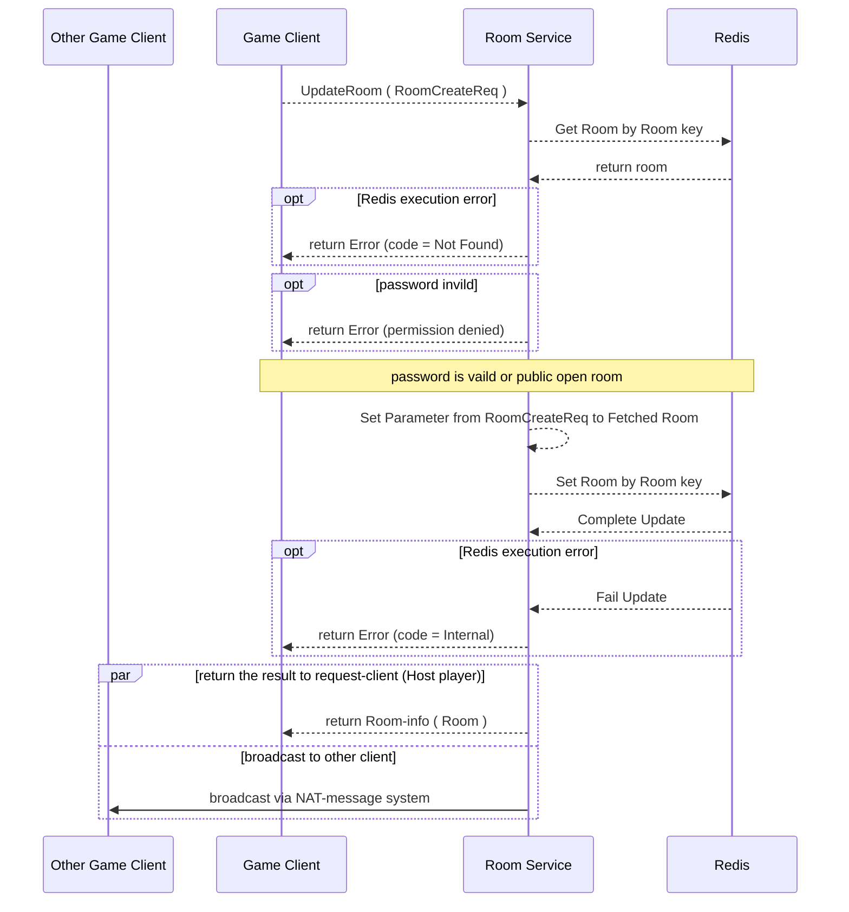
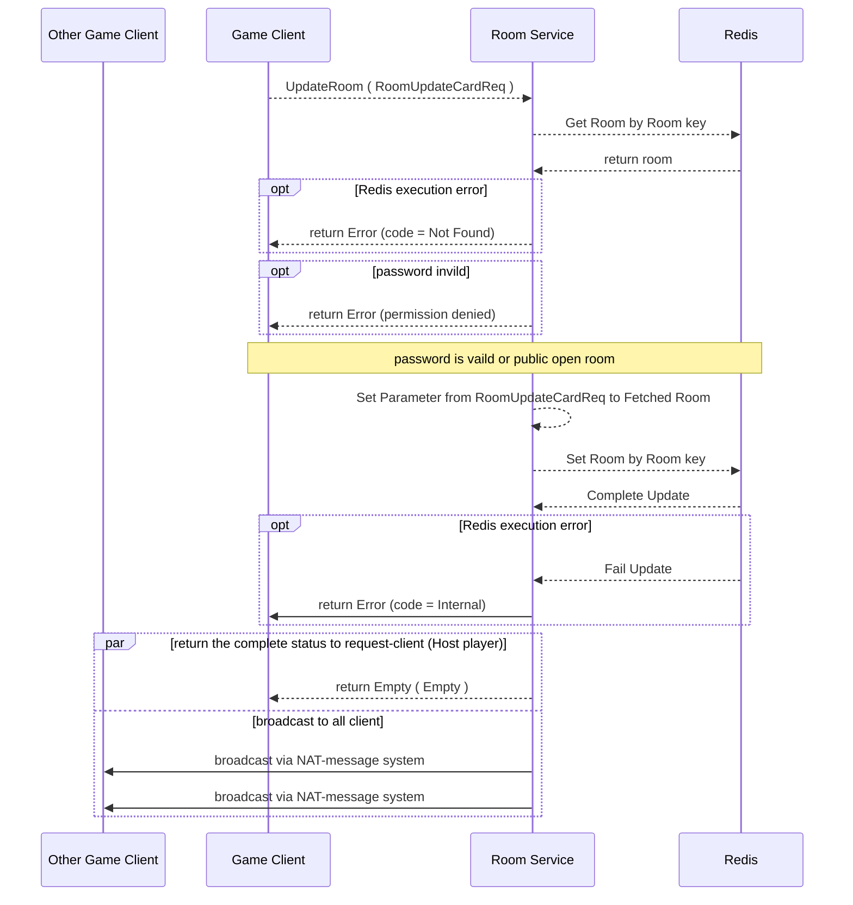
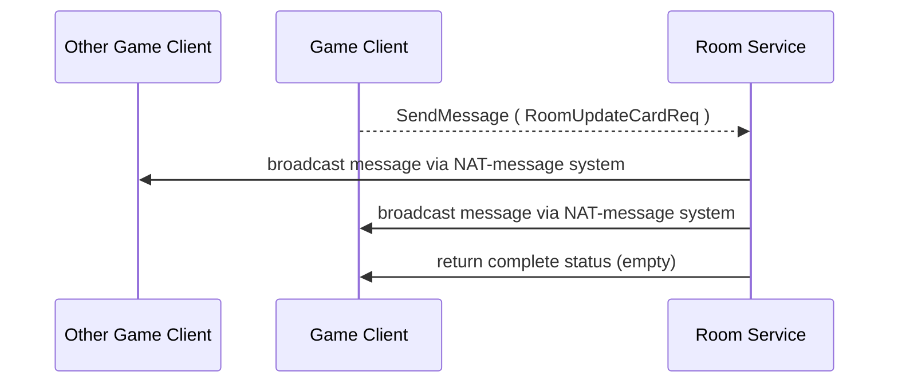
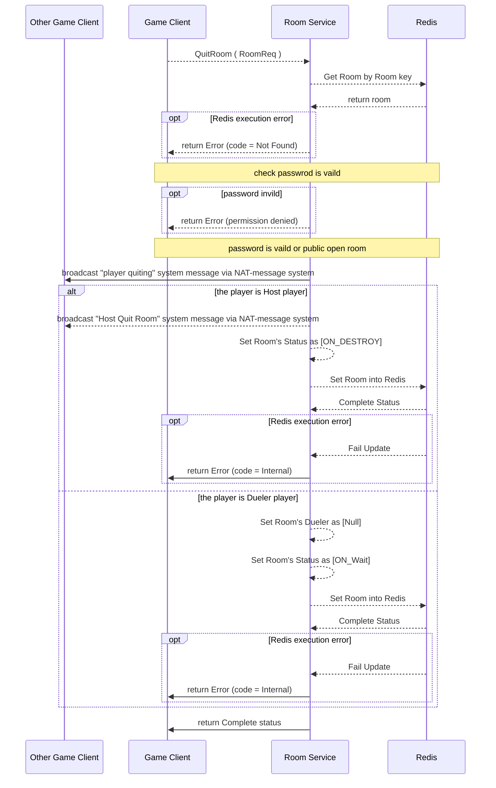
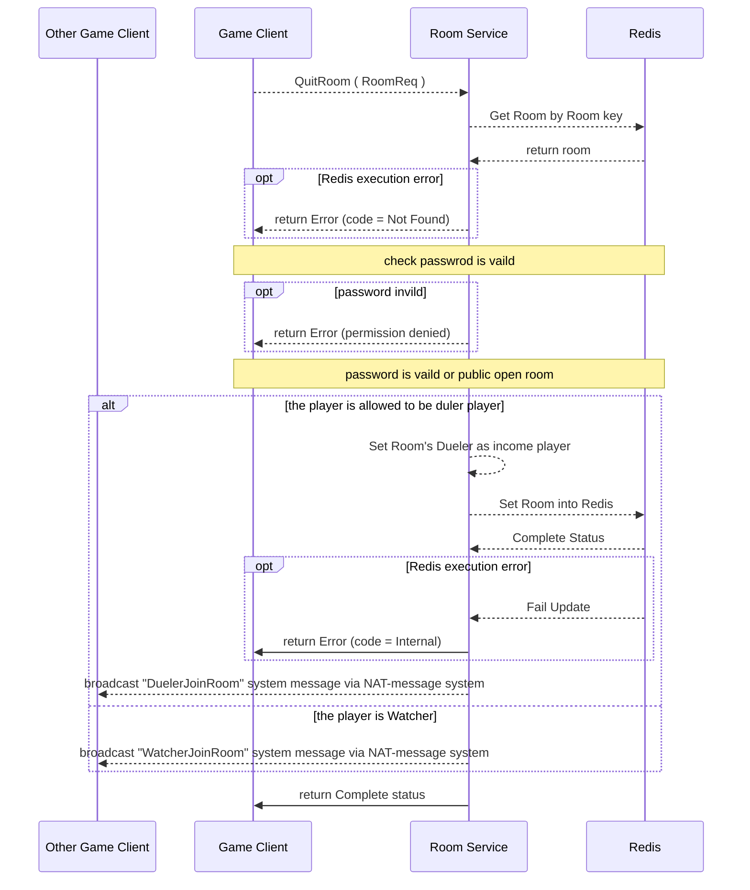

# Protocol Documentation

## Table of Contents

- [Protocol Documentation](#protocol-documentation)
  - [Table of Contents](#table-of-contents)
  - [service.proto](#serviceproto)
    - [RoomService](#roomservice)
      - [Create Room](#create-room)
        - [Work Flow](#work-flow)
      - [Get Room List](#get-room-list)
        - [Work Flow](#work-flow-1)
      - [Get Room Info](#get-room-info)
      - [Workflow](#workflow)
      - [Update Room](#update-room)
      - [Workflow](#workflow-1)
      - [Update Card](#update-card)
      - [Workflow](#workflow-2)
      - [Send Message](#send-message)
        - [WorkFlow](#workflow-3)
      - [QuitRoom](#quitroom)
        - [WorkFlow](#workflow-4)
      - [JoinRoom](#joinroom)
  
- [Scalar Value Types](#scalar-value-types)

<a href="#top">Top</a>

## service.proto

### RoomService

| Method Name | Request Type                                     | Response Type                 | Description |
| ----------- | ------------------------------------------------ | ----------------------------- | ----------- |
| CreateRoom  | [RoomCreateReq](#ULZProto.RoomCreateReq)         | [Room](#ULZProto.Room)        |             |
| GetRoomList | [RoomCreateReq](#ULZProto.RoomCreateReq)         | [Room](#ULZProto.Room) stream |             |
| GetRoomInfo | [RoomReq](#ULZProto.RoomReq)                     | [Room](#ULZProto.Room)        |             |
| UpdateRoom  | [RoomCreateReq](#ULZProto.RoomCreateReq)         | [Room](#ULZProto.Room)        |             |
| UpdateCard  | [RoomUpdateCardReq](#ULZProto.RoomUpdateCardReq) | [Empty](#ULZProto.Empty)      |             |
| SendMessage | [RoomMsg](#ULZProto.RoomMsg)                     | [Empty](#ULZProto.Empty)      |             |
| QuitRoom    | [RoomReq](#ULZProto.RoomReq)                     | [Empty](#ULZProto.Empty)      |             |
| QuickPair   | [RoomCreateReq](#ULZProto.RoomCreateReq)         | [Room](#ULZProto.Room)        |             |
| JoinRoom    | [RoomReq](#ULZProto.RoomReq)                     | [Room](#ULZProto.Room)        |             |

 
#### Create Room 
Create the Game Room , including the limitation.

##### Work Flow

#### Get Room List 
Fetch the Game Room with searching parameter.

##### Work Flow

#### Get Room Info
get game room detail information.

#### Workflow

#### Update Room
For host player to update the limitation.

#### Workflow

#### Update Card 
For both player to update the Character Card.
#### Workflow

#### Send Message 
sending the command / broadcast message

##### WorkFlow 

#### QuitRoom 
Player / Watcher quiting the game room.
- broadcast who leaving the room, and unregister from NAT-message system(if it is needed)
- if it is host player, the game room is set as \[ON_DESTROY\], so unable other player to join this room.
- if it is dueler player, the game room is set as \[ON_WAIT\], so other player is able to join the game as dueler player.

##### WorkFlow 

#### JoinRoom
To allow player to join to game room , \
if the game room have dueler player, other player is rejected to join as dueler.

